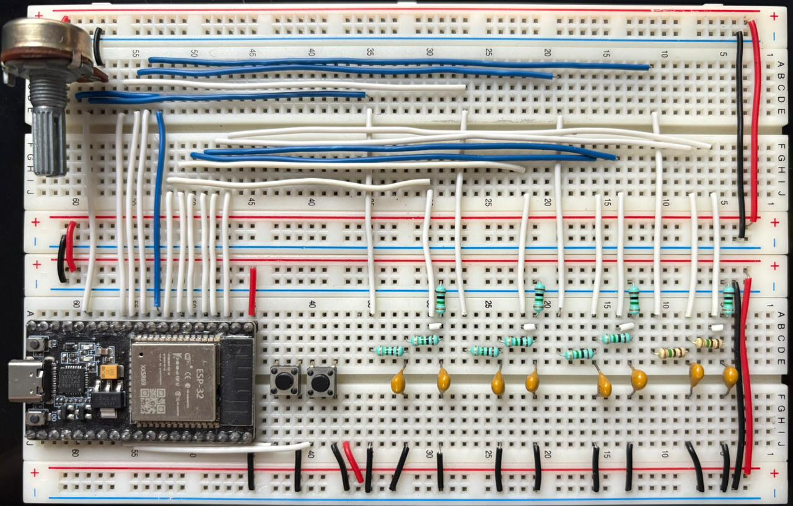
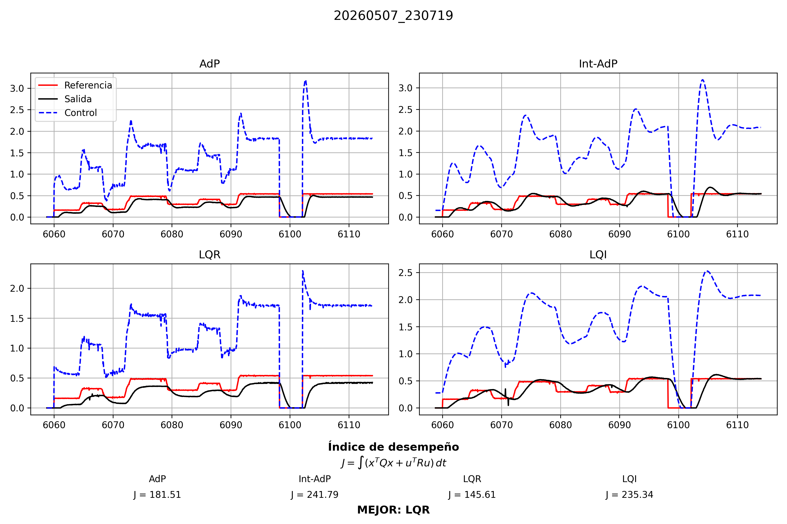

# Control Óptimo de un Sistema RC con ESP32

Proyecto desarrollado para la unidad de aprendizaje de **Control Óptimo** en la Facultad de Ingeniería Mecánica y Eléctrica (FIME-UANL).

El trabajo consiste en el modelado matemático, análisis, diseño e implementación experimental de distintas estrategias de control moderno aplicadas a un sistema eléctrico RC de segundo orden utilizando un microcontrolador ESP32.

El proyecto incluye:

- Modelado en espacio de estados
- Diseño de controladores por asignación de polos
- Control óptimo LQR
- Control óptimo integral LQI
- Observador de Luenberger
- Seguimiento de referencia mediante prealimentación
- Monitoreo en tiempo real
- Validación experimental de desempeño

---

# Características principales

- Implementación completa en ESP32
- Comparación simultánea de 4 controladores
- Diseño mediante Riccati continuo
- Observador de estados
- Interfaz de monitoreo en Python
- Exportación automática de datos experimentales
- Evaluación numérica del índice de desempeño

---

# Tabla de contenido

- [Modelo del sistema](#modelo-del-sistema)
- [Índice de desempeño](#índice-de-desempeño)
- [Controladores implementados](#controladores-implementados)
  - [Asignación de polos](#1-asignación-de-polos)
  - [Control integral por asignación de polos](#2-control-integral-por-asignación-de-polos)
  - [Control óptimo LQR](#3-control-óptimo-lqr)
  - [Control óptimo con acción integral (LQI)](#4-control-óptimo-con-acción-integral-lqi)
  - [Observador de Luenberger](#5-observador-de-luenberger)
  - [Seguimiento de referencia](#6-seguimiento-de-referencia)
- [Implementación experimental](#implementación-experimental)
- [Sistema de monitoreo](#sistema-de-monitoreo)
- [Resultados experimentales](#resultados-experimentales)
- [Tecnologías utilizadas](#tecnologías-utilizadas)
- [Referencias](#referencias)
- [Autor](#autor)

---

# Modelo del sistema

El sistema bajo estudio corresponde a una red RC de segundo orden compuesta por resistencias y capacitores.

## Circuito eléctrico

<!-- INSERTAR AQUÍ LA IMAGEN DEL CIRCUITO GENERADA CON CIRCUITIKZ -->

---

Las variables de estado se definieron como:

$$
x_1 = V_1
$$

$$
x_2 = V_2
$$

con salida:

$$
y = x_2
$$

Aplicando las leyes de Kirchhoff se obtiene la representación en espacio de estados:

$$
\dot{x} = Ax + Bu
$$

$$
y = Cx
$$

donde:

$$
A =
\begin{bmatrix}
-\frac{1}{R_1 C_1} - \frac{1}{R_2 C_1} & \frac{1}{R_2 C_1} \\
\frac{1}{R_2 C_2} & -\frac{1}{R_2 C_2} - \frac{1}{R_3 C_2}
\end{bmatrix}
$$

$$
B =
\begin{bmatrix}
\frac{1}{R_1 C_1} \\
0
\end{bmatrix}
$$

$$
C =
\begin{bmatrix}
0 & 1
\end{bmatrix}
$$

---

# Índice de desempeño

El controlador óptimo LQR fue diseñado mediante la minimización del funcional cuadrático:

$$
J =
\int_{0}^{\infty}
\left(
x^TQx + u^TRu
\right)dt
$$

Utilizando:

$$
Q =
\begin{bmatrix}
1 & 0 \\
0 & 5
\end{bmatrix}
$$

$$
R = 1
$$

Este criterio permite balancear:

- Seguimiento de referencia
- Rapidez de respuesta
- Energía de control

---

# Controladores implementados

## 1. Asignación de polos

Se implementó una ley de control por retroalimentación de estados:

$$
u = -Kx + gr
$$

con:

$$
K =
\begin{bmatrix}
k_1 & k_2
\end{bmatrix}
$$

La dinámica en lazo cerrado queda definida por:

$$
\dot{x} = (A-BK)x + Bgr
$$

Se selecciona un polinomio deseado de segundo orden:

$$
(\lambda-a_1)(\lambda-a_2)
=
\lambda^2 + \alpha_1\lambda + \alpha_2
$$

donde:

$$
\alpha_1 = -(a_1+a_2)
$$

$$
\alpha_2 = a_1a_2
$$

Igualando coeficientes del polinomio característico se obtienen las ganancias:

$$
k_1 = R_1C_1
\left(
\alpha_1
-\frac{1}{R_1C_1}
-\frac{1}{R_2C_1}
-\frac{1}{R_2C_2}
-\frac{1}{R_3C_2}
\right)
$$

$$
\begin{aligned}
k_2 = R_1R_2C_1C_2
\Bigg(
&\alpha_2
-\frac{1}{R_1R_2C_1C_2}
-\frac{1}{R_1R_3C_1C_2}
-\frac{1}{R_2R_3C_1C_2}\\
&-\frac{k_1}{R_1R_2C_1C_2}
-\frac{k_1}{R_1R_3C_1C_2}
\Bigg)
\end{aligned}
$$

---

## 2. Control integral por asignación de polos

Con el propósito de eliminar el error en estado estacionario se incorporó un integrador:

$$
x_0 = \int (r-y)dt
$$

La ley de control implementada fue:

$$
u = k_0x_0-k_1x_1-k_2x_2
$$

El sistema aumentado se define como:

$$
\dot{X}_a = A_{cl}X_a + B_ar
$$

Se selecciona un polinomio deseado de tercer orden:

$$
(\lambda-a_1)(\lambda-a_2)(\lambda-a_3)
=
\lambda^3 + \alpha_1\lambda^2 + \alpha_2\lambda + \alpha_3
$$

con:

$$
\alpha_1 = -(a_1+a_2+a_3)
$$

$$
\alpha_2 = a_1a_2+a_1a_3+a_2a_3
$$

$$
\alpha_3 = -a_1a_2a_3
$$

Las ganancias obtenidas fueron:

$$
k_0 = R_1R_2C_1C_2\alpha_3
$$

$$
k_1 = R_1C_1
\left(
\alpha_1
-\frac{1}{R_1C_1}
-\frac{1}{R_2C_1}
-\frac{1}{R_2C_2}
-\frac{1}{R_3C_2}
\right)
$$

$$
k_2 =
R_1R_2C_1C_2
\left(
\alpha_2
-\frac{1}{R_2R_3C_1C_2}
-\frac{1+k_1}{R_1R_3C_1C_2}
\right)
-1-k_1
$$

---

## 3. Control óptimo LQR

El controlador óptimo fue diseñado resolviendo la ecuación algebraica de Riccati continua:

$$
A^TP + PA - PBR^{-1}B^TP + Q = 0
$$

El cálculo numérico se realizó utilizando Python:

```python
P = solve_continuous_are(A,B,Q,R)
K = np.linalg.inv(R) @ B.T @ P
````

Resultado obtenido:

$$
K =
\begin{bmatrix}
0.41421356 & 0.41421356
\end{bmatrix}
$$

---

## 4. Control óptimo con acción integral (LQI)

El controlador LQI fue desarrollado aumentando el sistema con acción integral y resolviendo nuevamente la ecuación algebraica de Riccati.

El sistema aumentado utilizado fue:

$$
\dot{X}_a = A_aX_a + B_au
$$

con:

$$
A_a =
\begin{bmatrix}
0 & 0 & -1 \\
0 & -\frac{1}{R_1 C_1} - \frac{1}{R_2 C_1} & \frac{1}{R_2 C_1} \\
0 & \frac{1}{R_2 C_2} & -\frac{1}{R_2 C_2} - \frac{1}{R_3 C_2}
\end{bmatrix}
$$

y:

$$
Q_a =
\begin{bmatrix}
10 & 0 & 0 \\
0 & 1 & 0 \\
0 & 0 & 5
\end{bmatrix}
$$

El cálculo numérico se realizó mediante:

```python
P = solve_continuous_are(Aa,Ba,Qa,R)
K = np.linalg.inv(R) @ Ba.T @ P
```

El controlador LQI permitió eliminar el error estacionario manteniendo un enfoque óptimo sobre el sistema aumentado.

---

## 5. Observador de Luenberger

Para los controladores basados en asignación de polos se implementó un observador de estados de orden completo debido a que experimentalmente únicamente se mide el segundo capacitor.

El observador utilizado fue:

$$
\dot{\hat{x}} =
A\hat{x} + Bu + H(y-C\hat{x})
$$

con:

$$
H =
\begin{bmatrix}
h_1 \
h_2
\end{bmatrix}
$$

La dinámica del error queda definida por:

$$
\dot{e} = (A-HC)e
$$

Se seleccionó un polinomio deseado:

$$
(\lambda-b_1)(\lambda-b_2)
==========================

\lambda^2 + \beta_1\lambda + \beta_2
$$

donde:

$$
\beta_1 = -(b_1+b_2)
$$

$$
\beta_2 = b_1b_2
$$

Las ganancias del observador fueron calculadas mediante igualación de coeficientes.

---

## 6. Seguimiento de referencia

Para garantizar seguimiento de referencia sin error estacionario se implementó una ganancia de prealimentación:

$$
u = -Kx + gr
$$

donde:

$$
g =
\begin{bmatrix}
K & 1
\end{bmatrix}
\begin{bmatrix}
A & B \\
C & D
\end{bmatrix}^{-1}
\begin{bmatrix}
0 \\
0 \\
1
\end{bmatrix}
$$

La expresión final obtenida fue:

$$
g =
k_1 + k_2 +
\frac{k_1R_2 + R_1 + R_2}{R_3}
+1
$$

---

# Implementación experimental

La validación experimental fue realizada utilizando:

* ESP32
* 4 plantas RC físicamente equivalentes
* Señales PWM
* Adquisición analógica
* Comunicación serial

Cada planta fue asociada a una estrategia de control distinta permitiendo realizar comparaciones simultáneas bajo las mismas condiciones experimentales.

## Implementación física

<p align="center">
  
</p>

---

# Sistema de monitoreo

Se desarrolló un sistema de monitoreo en tiempo real utilizando:

* PySide6
* PyQtGraph
* pandas

Características implementadas:

* Visualización en tiempo real
* Monitoreo simultáneo de 4 controladores
* Exportación automática a CSV
* Evaluación automática del índice de desempeño
* Generación automática de reportes

## Interfaz de monitoreo

<p align="center">
  
</p>

---

# Resultados experimentales

Los resultados obtenidos permitieron comparar el desempeño de:

* Asignación de polos
* Control integral por asignación de polos
* LQR
* LQI

El índice de desempeño fue calculado numéricamente mediante:

```python
J = ((x1**2 + 5*x2**2 + u**2) * dt).sum()
```

Los resultados experimentales mostraron que:

* El controlador LQR obtuvo el menor valor de (J)
* LQI presentó mejor seguimiento pero mayor costo total
* Los controladores por asignación de polos requirieron mayor esfuerzo de control

Los resultados experimentales validan que el controlador LQR proporciona el mejor compromiso entre seguimiento de referencia y energía de control respecto al funcional cuadrático planteado.

---

# Tecnologías utilizadas

## Hardware

* ESP32
* Protoboard
* Resistencias
* Capacitores

## Software

* Python
* NumPy
* SciPy
* Matplotlib
* PySide6
* PyQtGraph
* pandas
* Arduino IDE
* LaTeX

---

# Referencias

1. K. Ogata, *Modern Control Engineering*, 5th ed.

2. D. E. Kirk, *Optimal Control Theory: An Introduction*

3. G. F. Franklin, *Feedback Control of Dynamic Systems*

---

# Autor

**Gabriel González Alvarez**
Facultad de Ingeniería Mecánica y Eléctrica
Universidad Autónoma de Nuevo León
---
